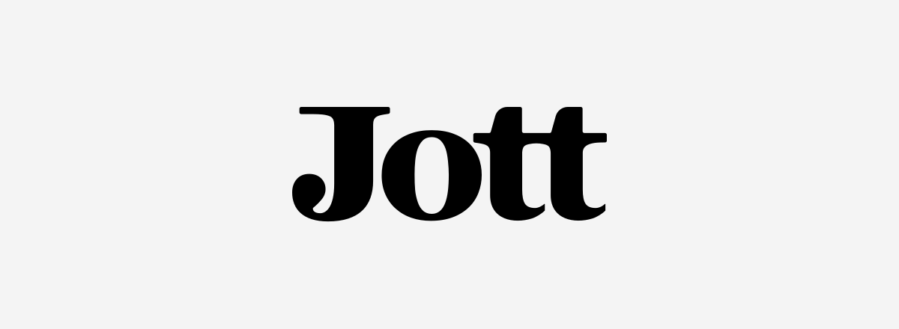
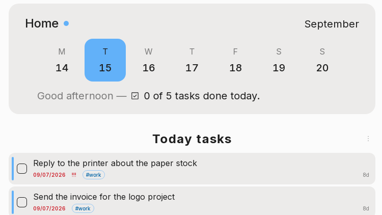
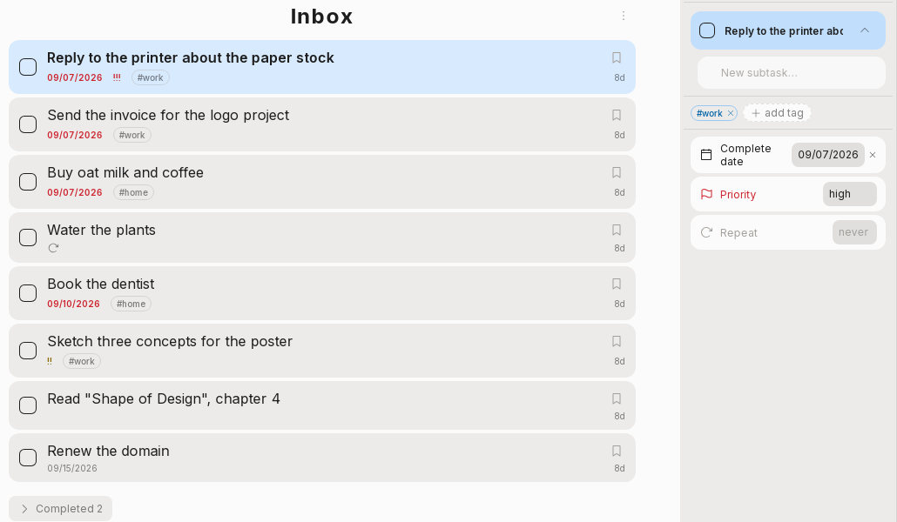
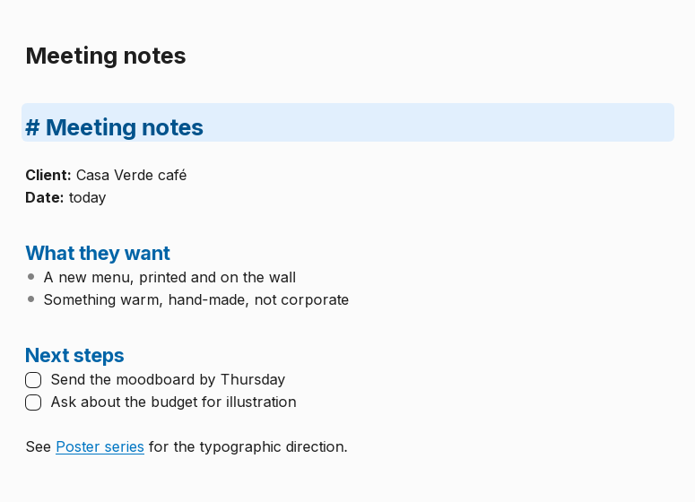
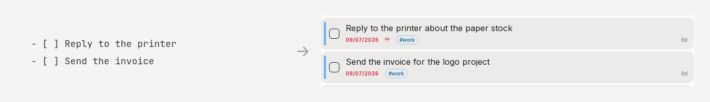

<div align="center">

<!-- media 1/5 · placeholder — final: the logo drawing itself, slogan typing in -->


# Jott

**Tasks and notes that live on your computer, in plain Markdown files you can open without the app.**

[Download](#install) · [Documentation](documentation/) · [Roadmap](#roadmap) · [Contributing](#contributing)

</div>

## What Jott is

Jott is a place to write things down before you forget them — a task, a thought, a page of notes — and to find them again on the day they matter. It has two halves: task lists that work the way a to-do app should, and a Markdown editor that stays out of the way. The app opens on **today**: a week across the top, and under it the handful of things you decided to face, instead of the whole backlog staring back at you.

What makes it different is underneath. There is no account, no server and no database — your notebook is **a folder of `.md` files you chose**, and every task is a checklist line you could have typed yourself. Open them in Obsidian, grep them, sync them with Syncthing, put them in git. If you stop using Jott tomorrow, nothing has to be exported: it's all already there, readable.

It runs on **Linux, Windows and Android** from one codebase, in English and Portuguese (Brazil), with a native interface rather than a packaged website, and it's **MIT-licensed** and free.

## Install

Grab the file for your platform from the [**latest release**](https://github.com/Gustavo-Tondin/jott-app/releases/latest):

| Your system | Download | Then |
|---|---|---|
| **Windows** | `jott-windows.exe` | Run it — no administrator password. Uninstall from Settings → Apps. |
| **Ubuntu / Debian** | `jott-ubuntu.deb` | Open the file, or `sudo apt install ./jott-ubuntu.deb` |
| **Fedora** | `jott-fedora.rpm` | Open the file, or `sudo dnf install ./jott-fedora.rpm` |
| **Any other Linux** | `jott-linux.AppImage` | `chmod +x jott-linux.AppImage`, then run it. To remove it, delete the file. |
| **Arch** | — | Build from source: `cd packaging/linux && makepkg -sid` |
| **Android** | `jott-android.apk` | Open the release page **on the phone**, download and tap the file. Android asks once to allow installs from your browser. |

**Updates.** Jott checks GitHub once a day for a new version (you can turn this off in Settings — it is the only connection the app ever makes, and it sends nothing about you or your notebook). The AppImage and the Windows build update themselves in place; package-manager installs and the APK get a button that opens the download page. A newer APK installs over the old one and keeps your data.

> **Windows warning on first run.** Jott isn't code-signed: Windows shows *"Windows protected your PC"* — click **More info**, then **Run anyway**. Once, per version.

---

## The day, first

<!-- media 2/5 · placeholder — final: the week strip gliding, a task rising into the day -->


Jott opens on today. A week sits across the top — drag it sideways for the weeks around it — and under it only what you chose to face. Pick a day ahead to plan it, a day gone by to read what happened on it. What you don't finish tonight either comes back as a suggestion or stays put; your call.

Nothing is ever archived or deleted behind your back: everything the notebook has held stays on a timeline, month by month.

## Tasks

<!-- media 3/5 · placeholder — final: one card with its fields pulled out around it -->


Inbox, plus as many lists as you want. Due dates, priorities, tags, subtasks, attachments, repetition, and reminders that ring through the system with the app closed. The order on screen is the order in the file — sort it, drag it, or reorder the file in another editor and the app keeps what you did. Every card answers to the keyboard, the mouse and the thumb alike.

## Notes

<!-- media 4/5 · placeholder — final: a note open on the phone, light theme -->


A board of cards — each one its banner, the note's name, and the first lines of the note drawn as Markdown — and an editor that shows the raw syntax only where your cursor is. `[[Note]]` links and file references autocomplete as you type; banners, pinning, folders, and tables you edit as a grid. Anything you paste from a browser, Docs or Notion arrives as Markdown, not as stripped plain text.

## Yours, on disk

<!-- media 5/5 · placeholder — final: the Markdown line morphing into the card -->


```
MyNotebook/
├── jott.tasks/          ← the app's task space
│   ├── task-list.md     ← shown as "Inbox" in the app
│   └── completed.md
├── jott.notes/          ← the app's space for loose notes
├── assets/              ← every image and file the notebook uses
├── Groceries/           ← a task list of yours
├── Work/                ← a group, gathering spaces
│   └── Clients/         ← a notes space of yours
└── .jott/               ← config and trash — nothing is ever destroyed
```

A task is a checklist line; a note is a file. Change either one outside the app and Jott follows, the open note included — and what two devices did apart is **put back together**, not overwritten. Every notebook documents its own format in plain text (`.jott/_FORMAT.txt`), so your files never depend on this repository to be understood. The full contract is in [`documentation/file-format.md`](documentation/file-format.md).

## Principles

- **Your data is yours** — local files, open format, readable outside the app, no lock-in.
- **Simple first** — anything advanced is optional and doesn't clutter the basics.
- **What's local is free, forever.** Online services (sync, backup) may come later as paid options, but no local feature will ever be removed to push a subscription.
- **Privacy** — the app makes no connection beyond the optional update check.

## Roadmap

Jott is pre-1.0 and used daily. The [releases page](https://github.com/Gustavo-Tondin/jott-app/releases) says where it is; [`CHANGELOG.md`](CHANGELOG.md) says what changed.

**Now — before v1.** Finishing the time axis (sorting by age, then a weekly sweep of what you haven't looked at), Android on real hardware, and clicking through what so far only tests have seen.

**Next — after v1.** Table and kanban views of the list you already have; local version history for a note; a command palette; system-wide capture; a smaller theme format; more languages, importers (Todoist, Microsoft To Do, Obsidian Tasks) and PDF export.

**Later — optional paid services**, never replacing a local feature: end-to-end encrypted sync, cloud backup, sharing. Syncing today is already free and works — point Syncthing, Drive or git at the notebook folder.

## Contributing

Questions and ideas go to [Discussions](https://github.com/Gustavo-Tondin/jott-app/discussions); bugs to [Issues](https://github.com/Gustavo-Tondin/jott-app/issues/new/choose). Pull requests are welcome: start with [`CONTRIBUTING.md`](CONTRIBUTING.md) — setup, the two test suites, and the handful of rules that keep this codebase the way it is.

Writing a **theme** is the smallest useful contribution and needs no Rust: [`documentation/theming.md`](documentation/theming.md).

## Development

Requirements: Rust (stable, via `rustup`), Node.js with npm, and the system libraries `webkit2gtk-4.1`, `gtk3` and `libsoup3`.

```bash
npm install          # frontend dependencies
npm run tauri dev    # run the app
cargo test           # business logic tests
npm test             # frontend tests
npm run package      # build AppImage / deb / rpm
```

| Folder | What it is |
| --- | --- |
| `core/` | Pure Rust crate with all the business logic. No Tauri dependency. |
| `src-tauri/` | Thin shell that exposes `core` to the frontend via `invoke()`. |
| `src/` | Svelte frontend, with plain CSS. |
| `documentation/` | Architecture, file format, theming, contributing. |

Platform-specific build notes (AppImage stripping, Windows CI, the Android SDK and its storage permission) are in [`documentation/building.md`](documentation/building.md).

## License

Jott is free software under the [MIT License](LICENSE) — use it, read it, fork it, ship your own build of it. The notebook it writes is plain Markdown, so your side of the deal never depended on the license anyway.
